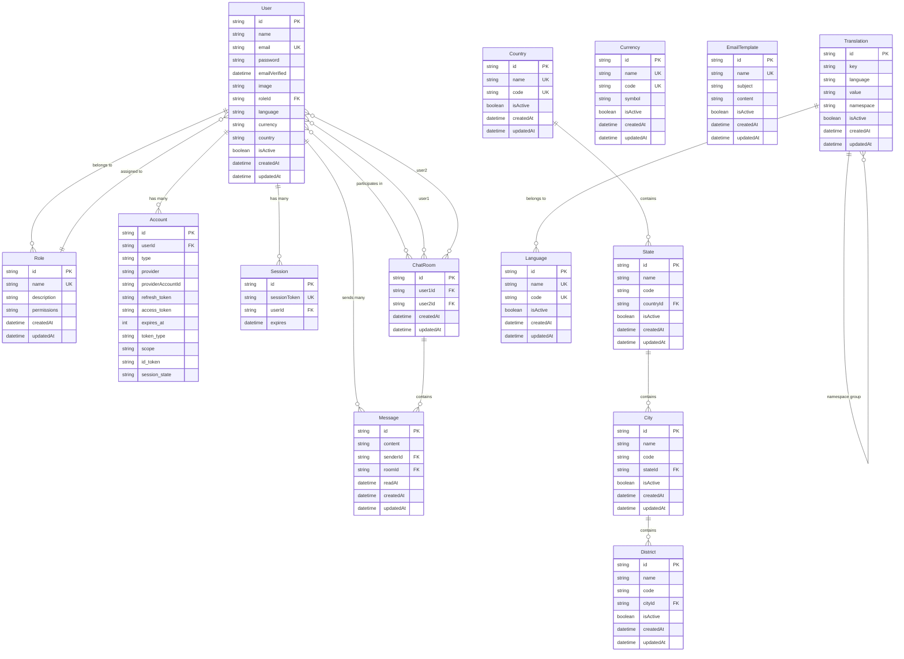

# Database Schema & Design

This document provides detailed information about the database schema, relationships, and data management in the Materio MUI Next.js Admin Template.

## 🗄️ Database Overview

The application uses **Prisma ORM** with **SQLite** as the database engine. SQLite is chosen for development ease but can be easily switched to PostgreSQL or MySQL for production.

### Database Configuration

```prisma
datasource db {
  provider = "sqlite"
  url      = env("DATABASE_URL")
}

generator client {
  provider        = "prisma-client-js"
  binaryTargets   = ["native", "debian-openssl-3.0.x", "linux-arm64-openssl-1.1.x", "rhel-openssl-3.0.x"]
}
```

## 📊 Entity-Relationship Diagram



## 🔑 Core Entities

### User Model

The central entity representing system users.

```prisma
model User {
  id            String    @id @default(cuid())
  name          String?
  email         String    @unique
  password      String
  emailVerified DateTime?
  image         String?
  roleId        String
  language      String    @default("Russian")
  currency      String    @default("RUB")
  country       String    @default("russia")
  isActive      Boolean   @default(true)
  role          Role      @relation(fields: [roleId], references: [id])
  accounts      Account[]
  sessions      Session[]
  sentMessages  Message[] @relation("MessageSender")
  user1Rooms    ChatRoom[] @relation("User1Rooms")
  user2Rooms    ChatRoom[] @relation("User2Rooms")
  createdAt     DateTime  @default(now())
  updatedAt     DateTime  @updatedAt
}
```

**Key Fields:**
- `id`: CUID primary key
- `email`: Unique identifier for authentication
- `roleId`: Foreign key to Role (required)
- `isActive`: Soft delete/active status flag
- `language/currency/country`: User preferences

### Role Model

Defines user roles and their associated permissions.

```prisma
model Role {
  id          String   @id @default(cuid())
  name        String   @unique
  description String?
  permissions String?  @default("{}")  // JSON: {"module": ["action1", "action2"]}
  users       User[]
  createdAt   DateTime @default(now())
  updatedAt   DateTime @updatedAt
}
```

**Permissions Structure:**
```json
{
  "userManagement": ["read", "create", "update", "delete"],
  "roleManagement": ["read", "create", "update"],
  "emailTemplates": ["read", "update"],
  "settings": ["read", "update"]
}
```

## 💬 Chat System

### ChatRoom Model

Represents a conversation between two users.

```prisma
model ChatRoom {
  id        String   @id @default(cuid())
  user1Id   String
  user2Id   String
  user1     User     @relation("User1Rooms", fields: [user1Id], references: [id], onDelete: Cascade)
  user2     User     @relation("User2Rooms", fields: [user2Id], references: [id], onDelete: Cascade)
  messages  Message[]
  createdAt DateTime @default(now())
  updatedAt DateTime @updatedAt

  @@unique([user1Id, user2Id])
}
```

### Message Model

Individual messages within chat rooms.

```prisma
model Message {
  id        String   @id @default(cuid())
  content   String
  senderId  String
  sender    User     @relation("MessageSender", fields: [senderId], references: [id], onDelete: Cascade)
  roomId    String
  room      ChatRoom @relation(fields: [roomId], references: [id], onDelete: Cascade)
  readAt    DateTime?
  createdAt DateTime @default(now())
  updatedAt DateTime @updatedAt
}
```

## 🌍 Geographic Data

Hierarchical location structure for user profiles.

### Country → State → City → District

```prisma
model Country {
  id          String   @id @default(cuid())
  name        String   @unique
  code        String   @unique
  isActive    Boolean  @default(true)
  states      State[]
  createdAt   DateTime @default(now())
  updatedAt   DateTime @updatedAt
}

model State {
  id          String   @id @default(cuid())
  name        String
  code        String
  countryId   String?
  country     Country? @relation(fields: [countryId], references: [id], onDelete: Cascade)
  isActive    Boolean  @default(true)
  cities      City[]
  createdAt   DateTime @default(now())
  updatedAt   DateTime @updatedAt

  @@unique([name, id])
}
```

## 🌐 Internationalization

### Language Model

Supported languages for the application.

```prisma
model Language {
  id          String   @id @default(cuid())
  name        String   @unique
  code        String   @unique
  isActive    Boolean  @default(true)
  createdAt   DateTime @default(now())
  updatedAt   DateTime @updatedAt
}
```

### Translation Model

Key-value translations for different languages.

```prisma
model Translation {
  id          String   @id @default(cuid())
  key         String   // e.g., "navigation.dashboards"
  language    String   // e.g., "en", "fr", "ar"
  value       String   // The translated text
  namespace   String   @default("common") // e.g., "navigation", "common", "forms"
  isActive    Boolean  @default(true)
  createdAt   DateTime @default(now())
  updatedAt   DateTime @updatedAt

  @@unique([key, language, namespace])
}
```

## 📧 Email Templates

### EmailTemplate Model

Customizable email templates for notifications.

```prisma
model EmailTemplate {
  id          String   @id @default(cuid())
  name        String   @unique
  subject     String
  content     String
  isActive    Boolean  @default(true)
  createdAt   DateTime @default(now())
  updatedAt   DateTime @updatedAt
}
```

## 🔐 Authentication Models

### Account Model

OAuth provider accounts linked to users.

```prisma
model Account {
  id                 String  @id @default(cuid())
  userId             String
  type               String
  provider           String
  providerAccountId  String
  refresh_token      String?
  access_token       String?
  expires_at         Int?
  token_type         String?
  scope              String?
  id_token           String?
  session_state      String?

  user User @relation(fields: [userId], references: [id], onDelete: Cascade)

  @@unique([provider, providerAccountId])
}
```

### Session Model

Active user sessions for NextAuth.js.

```prisma
model Session {
  id           String   @id @default(cuid())
  sessionToken String   @unique
  userId       String
  expires      DateTime
  user         User     @relation(fields: [userId], references: [id], onDelete: Cascade)
}
```

### VerificationToken Model

Email verification and password reset tokens.

```prisma
model VerificationToken {
  identifier String
  token      String   @unique
  expires    DateTime

  @@unique([identifier, token])
}
```

## 🏭 Data Seeding

The application includes a comprehensive seeding script that populates initial data.

### Default Roles

```typescript
const roles = [
  {
    name: 'superadmin',
    description: 'Full system access',
    permissions: 'all'
  },
  {
    name: 'admin',
    description: 'Administrative access',
    permissions: { /* admin permissions */ }
  },
  // ... more roles
]
```

### Sample Data

- **Users**: Admin user with default credentials
- **Countries/States/Cities**: Geographic data for Russia
- **Languages**: English and Russian support
- **Currencies**: RUB, USD, EUR
- **Email Templates**: Welcome, password reset, notifications

## 🔄 Database Operations

### Common Queries

#### Get User with Role
```typescript
const user = await prisma.user.findUnique({
  where: { email },
  include: { role: true }
})
```

#### Get Users with Pagination
```typescript
const users = await prisma.user.findMany({
  include: { role: true },
  orderBy: { createdAt: 'desc' },
  skip: (page - 1) * limit,
  take: limit
})
```

#### Get Chat Messages
```typescript
const messages = await prisma.message.findMany({
  where: { roomId },
  include: { sender: true },
  orderBy: { createdAt: 'asc' }
})
```

### Indexing Strategy

- **Primary Keys**: All tables have efficient CUID primary keys
- **Unique Constraints**: Email, role names, provider accounts
- **Foreign Keys**: Cascading deletes for data integrity
- **Composite Indexes**: Chat room uniqueness (user1Id, user2Id)

## 🚀 Migration Strategy

### Development Migrations

```bash
# Generate migration
npx prisma migrate dev --name add_new_feature

# Apply migrations
npx prisma migrate deploy

# Reset database
npx prisma migrate reset
```

### Production Deployments

```bash
# Mark migration as applied
npx prisma migrate deploy

# Generate Prisma client
npx prisma generate
```

## 📈 Performance Considerations

### Query Optimization

- **Include vs Select**: Use `select` for better performance when not all fields are needed
- **Pagination**: Implement cursor-based pagination for large datasets
- **Caching**: In-memory caching for frequently accessed data (users, roles)

### Connection Management

- **Connection Pooling**: Prisma handles connection pooling automatically
- **Query Batching**: Multiple queries in a single transaction
- **Lazy Loading**: Load related data only when needed

## 🔒 Security Measures

### Data Protection

- **Password Hashing**: bcrypt with salt rounds for user passwords
- **Input Validation**: Prisma schema validation and application-level checks
- **SQL Injection Prevention**: Parameterized queries via Prisma
- **Soft Deletes**: `isActive` flags instead of hard deletes

### Access Control

- **Row-Level Security**: Permission checks before database operations
- **Audit Trail**: Created/updated timestamps on all records
- **Session Management**: Automatic session cleanup and validation

This database schema provides a solid foundation for a scalable admin application with proper relationships, constraints, and performance optimizations.
