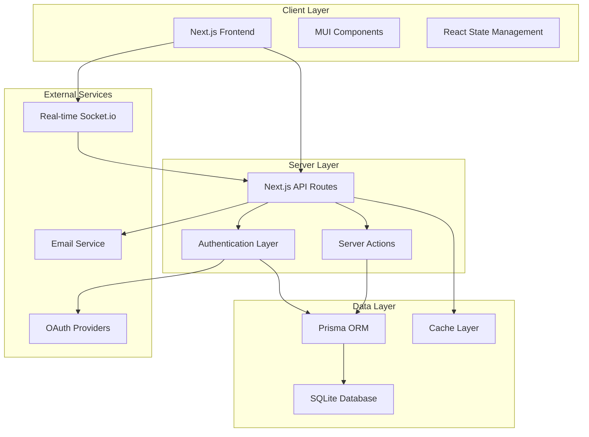
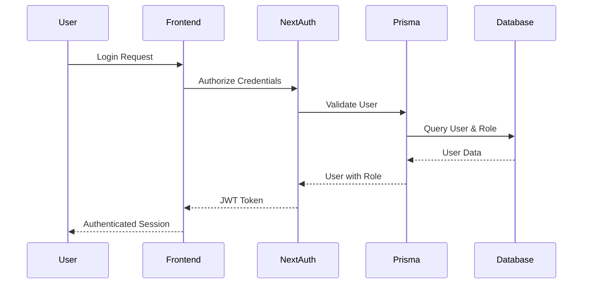
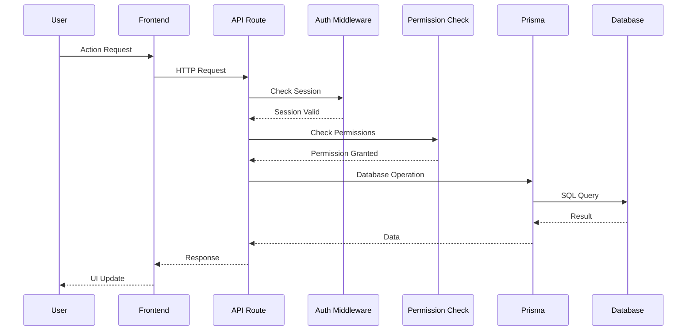
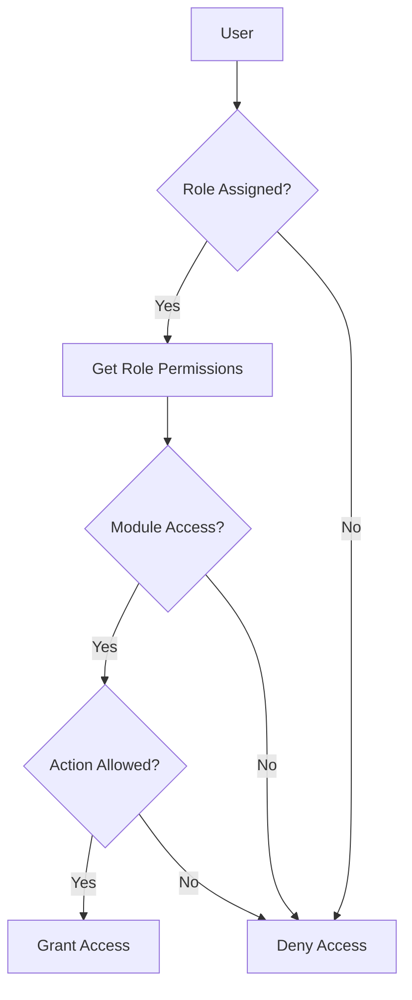
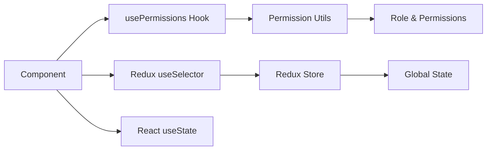
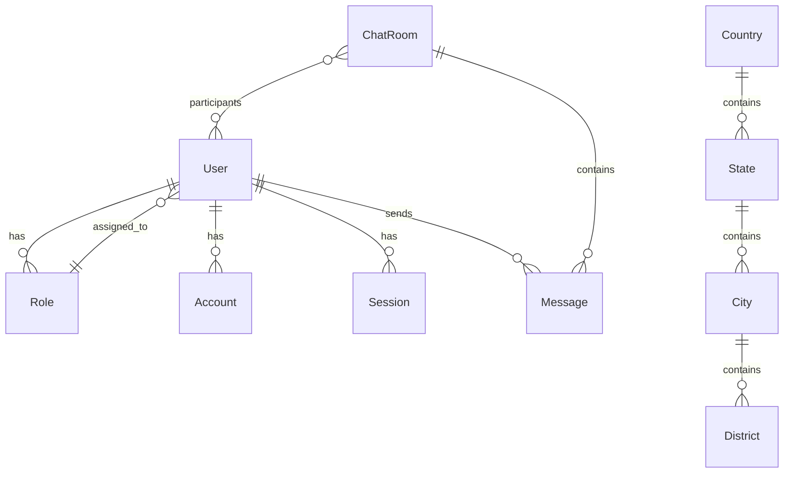
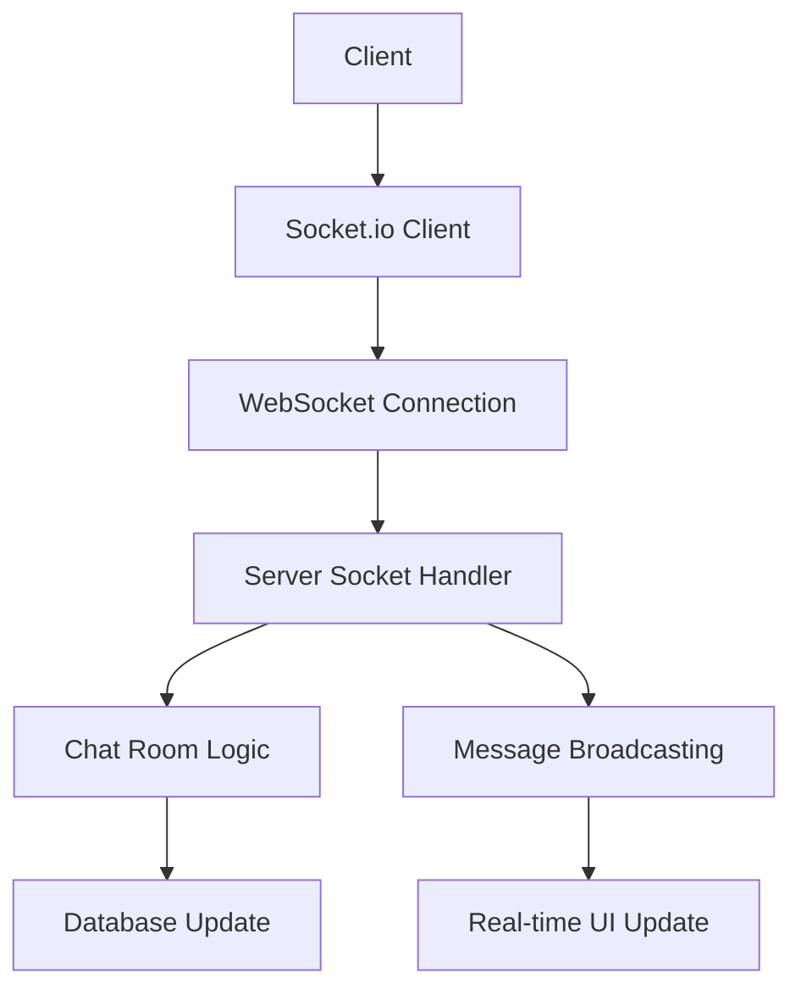
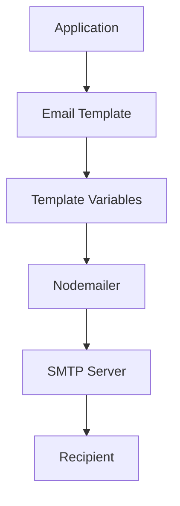
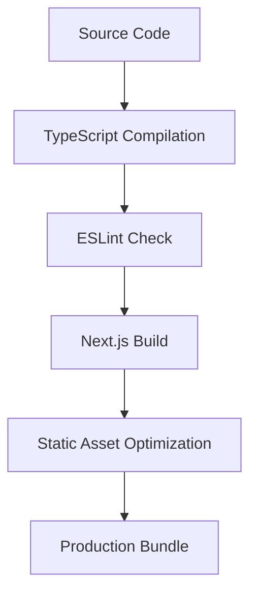
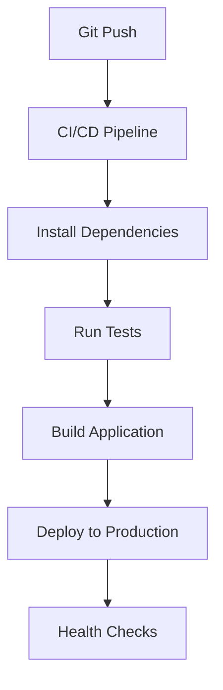

# Architecture Overview

This document provides a comprehensive overview of the Materio MUI Next.js Admin Template architecture, including system design, data flow, and component organization.

## 🏗️ System Architecture

### High-Level Architecture



### Technology Stack

| Layer | Technology | Purpose |
|-------|------------|---------|
| **Frontend** | Next.js 15, React 18 | Server-side rendering, routing |
| **UI Library** | Material-UI v6 | Component library, theming |
| **Styling** | Tailwind CSS | Utility-first CSS framework |
| **State Management** | Redux Toolkit | Global state management |
| **Backend** | Next.js API Routes | RESTful API endpoints |
| **Database** | Prisma + SQLite | ORM and database |
| **Authentication** | NextAuth.js | Session management, OAuth |
| **Real-time** | Socket.io | WebSocket communication |
| **Email** | Nodemailer | Email sending |
| **Internationalization** | next-intl | Multi-language support |

## 📁 Project Structure

### Directory Organization

```
src/
├── app/                          # Next.js App Router
│   ├── [lang]/                  # Internationalized routes
│   │   ├── (auth)/              # Authentication pages
│   │   ├── (dashboard)/         # Protected dashboard pages
│   │   │   ├── (private)/       # Role-protected pages
│   │   │   └── (public)/        # Public dashboard pages
│   │   └── globals.css          # Global styles
│   ├── api/                     # API routes
│   │   ├── admin/               # Admin-only endpoints
│   │   ├── apps/                # App-specific endpoints
│   │   └── auth/                # Authentication endpoints
│   └── layout.tsx               # Root layout
├── components/                   # Reusable UI components
│   ├── layout/                  # Layout components
│   │   ├── vertical/            # Vertical navigation
│   │   └── horizontal/          # Horizontal navigation
│   ├── card/                    # Card components
│   └── form/                    # Form components
├── hooks/                       # Custom React hooks
│   ├── usePermissions.ts        # Permission checking
│   ├── useChat.ts              # Chat functionality
│   └── useSocket.ts            # Socket.io integration
├── libs/                        # Library configurations
│   ├── auth.ts                  # NextAuth configuration
│   ├── prisma.ts                # Prisma client
│   └── styles/                  # Component style wrappers
├── prisma/                      # Database layer
│   ├── schema.prisma            # Database schema
│   ├── seed.ts                  # Database seeding
│   └── migrations/              # Database migrations
├── redux-store/                 # Global state management
│   ├── slices/                  # Redux slices
│   └── ReduxProvider.tsx        # Provider component
├── types/                       # TypeScript definitions
│   ├── apps/                    # App-specific types
│   └── pages/                   # Page-specific types
├── utils/                       # Utility functions
│   ├── permissions.ts           # Permission utilities
│   ├── email.ts                 # Email utilities
│   └── i18n.ts                  # Internationalization
└── views/                       # Page components
    ├── apps/                    # App pages
    ├── pages/                   # Static pages
    └── front-pages/             # Landing/marketing pages
```

## 🔄 Data Flow

### Authentication Flow



### API Request Flow



## 🔐 Security Architecture

### Authentication & Authorization

- **Session Management**: JWT tokens with 30-day expiration
- **Role-Based Access Control**: Granular permissions per module/action
- **Middleware Protection**: Route-level authentication checks
- **Password Security**: bcrypt hashing with salt rounds
- **Session Validation**: Real-time user status checking

### Permission System



## 📊 State Management

### Redux Store Structure

```typescript
interface RootState {
  calendar: CalendarState
  chat: ChatState
  email: EmailState
  kanban: KanbanState
  // ... other slices
}
```

### Component State Flow



## 🔌 API Architecture

### Route Organization

- **RESTful Design**: Standard HTTP methods (GET, POST, PUT, DELETE)
- **Resource-Based**: `/api/admin/users`, `/api/apps/roles`
- **Versioning Ready**: Modular structure for API versioning
- **Error Handling**: Consistent error response format

### Server Actions

- **Form Handling**: Server-side form processing
- **Data Fetching**: Server components data loading
- **Security**: Server-side validation and sanitization

## 💾 Database Design

### Prisma Schema Overview



### Caching Strategy

- **In-Memory Cache**: User sessions and permissions (30s TTL)
- **Database Indexing**: Optimized queries for users and roles
- **Connection Pooling**: Prisma client reuse

## 🌐 Real-time Architecture

### Socket.io Integration



### Chat System Flow

1. **Connection**: User connects via Socket.io
2. **Room Join**: User joins chat room
3. **Message Send**: Message sent to server
4. **Broadcast**: Message delivered to room participants
5. **Persistence**: Message stored in database
6. **Read Status**: Read receipts tracked

## 📧 Email Architecture

### Email Service Flow



### Template System

- **Dynamic Templates**: Handlebars-style variable replacement
- **Multi-format**: HTML and plain text support
- **Localization**: Language-specific templates
- **Customization**: Admin-configurable templates

## 🚀 Performance Optimizations

### Frontend Optimizations

- **Server-Side Rendering**: Next.js SSR for initial page loads
- **Static Generation**: Pre-built pages where possible
- **Code Splitting**: Dynamic imports for large components
- **Image Optimization**: Next.js Image component
- **Caching**: Browser caching strategies

### Backend Optimizations

- **Database Indexing**: Optimized queries
- **Caching Layer**: In-memory caching for frequent data
- **Connection Pooling**: Efficient database connections
- **API Rate Limiting**: Prevent abuse (ready for implementation)

## 🔧 Development Workflow

### Build Process



### Deployment Pipeline



## 📈 Monitoring & Logging

### Error Handling

- **Global Error Boundaries**: React error boundaries
- **API Error Responses**: Consistent error format
- **Logging**: Console and file-based logging
- **User Feedback**: Toast notifications for errors

### Performance Monitoring

- **Core Web Vitals**: Next.js analytics
- **Database Queries**: Prisma query logging
- **API Response Times**: Request duration tracking
- **Memory Usage**: Node.js process monitoring

This architecture provides a scalable, maintainable foundation for building complex admin applications with modern web technologies.
