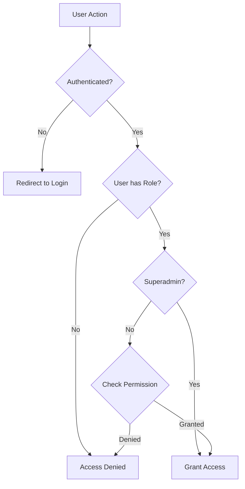

# Permissions & Role-Based Access Control

This document explains the role-based access control (RBAC) system implemented in the Materio MUI Next.js Admin Template.

## 🔐 Overview

The application uses a flexible permission system where:
- **Roles** define sets of permissions
- **Permissions** control access to specific modules and actions
- **Users** are assigned roles that determine their access levels

## 👥 Role Hierarchy

### Default Roles

| Role | Description | Permissions |
|------|-------------|-------------|
| **superadmin** | Unlimited access to all features | `"all"` - grants all permissions |
| **admin** | Full administrative access | Most permissions except superadmin functions |
| **manager** | Management-level access | Limited admin permissions |
| **editor** | Content editing permissions | Create, read, update content |
| **moderator** | Moderation permissions | Review and moderate user content |
| **seo** | SEO management | SEO-related permissions |
| **marketolog** | Marketing permissions | Marketing campaign management |
| **support** | Customer support | User support functions |
| **subscriber** | Basic user access | Limited read-only access |
| **user** | Standard user | Basic user permissions |

## 🔑 Permission Structure

### Permission Format

Permissions are stored as JSON strings in the database with the following structure:

```json
{
  "moduleName": ["action1", "action2", "action3"],
  "anotherModule": ["read", "write"]
}
```

### Available Actions

Common actions across modules:
- **read**: View/list data
- **create**: Create new records
- **update**: Modify existing records
- **delete**: Remove records

### Module-Based Permissions

#### User Management (`userManagement`)
```json
{
  "userManagement": ["read", "create", "update", "delete"]
}
```

#### Role Management (`roleManagement`)
```json
{
  "roleManagement": ["read", "create", "update", "delete"]
}
```

#### Email Templates (`emailTemplates`)
```json
{
  "emailTemplates": ["read", "create", "update", "delete"]
}
```

#### System Settings (`settings`)
```json
{
  "settings": ["read", "update"]
}
```

#### Geographic References (`references`)
```json
{
  "references": ["read", "create", "update", "delete"]
}
```

## 🛠️ Permission Utilities

### Core Functions

Located in [`src/utils/permissions.ts`](src/utils/permissions.ts):

#### `getUserPermissions(user)`
Extracts permissions from user role.

```typescript
function getUserPermissions(user: UserWithRole | null): Permissions
```

#### `checkPermission(user, module, action)`
Checks if user has specific permission.

```typescript
function checkPermission(user: UserWithRole | null, module: string, action: string): boolean
```

#### `hasRole(user, roleName)`
Checks if user has specific role.

```typescript
function hasRole(user: UserWithRole | null, roleName: string): boolean
```

#### `isSuperadmin(user)`
Checks if user is superadmin (unlimited access).

```typescript
function isSuperadmin(user: UserWithRole | null): boolean
```

### React Hook

Located in [`src/hooks/usePermissions.ts`](src/hooks/usePermissions.ts):

```typescript
function usePermissions() {
  // Returns user permissions and utility functions
  return {
    user,
    isLoading,
    isAuthenticated,
    hasRole: (roleName: string) => boolean,
    isAdmin: boolean,
    isSuperadmin: boolean,
    checkPermission: (module: string, action: string) => boolean,
    getUserPermissions: () => Permissions
  }
}
```

## 📋 Permission Checking Flow



## 🔧 API Permission Checks

### Server-Side Validation

All API routes perform permission checks:

```typescript
// Example from user management API
const currentUser = await prisma.user.findUnique({
  where: { email: session.user.email },
  include: { role: true }
})

if (!checkPermission(currentUser, 'userManagement', 'read')) {
  return NextResponse.json(
    { message: 'Permission denied: userManagement read required' },
    { status: 403 }
  )
}
```

### Frontend Permission Checks

Components use the permission hook:

```typescript
import { usePermissions } from '@/hooks/usePermissions'

function UserManagement() {
  const { checkPermission, isAdmin } = usePermissions()

  if (!checkPermission('userManagement', 'read')) {
    return <AccessDenied />
  }

  return (
    <div>
      {isAdmin && <AdminControls />}
      <UserList />
    </div>
  )
}
```

## 🎯 Permission Examples

### Admin User Permissions
```json
{
  "userManagement": ["read", "create", "update", "delete"],
  "roleManagement": ["read", "create", "update"],
  "emailTemplates": ["read", "create", "update", "delete"],
  "settings": ["read", "update"],
  "references": ["read", "create", "update", "delete"]
}
```

### Editor User Permissions
```json
{
  "content": ["read", "create", "update"],
  "media": ["read", "create", "update"]
}
```

### Subscriber User Permissions
```json
{
  "profile": ["read", "update"],
  "content": ["read"]
}
```

## 🗄️ Database Schema

### Role Model
```prisma
model Role {
  id          String   @id @default(cuid())
  name        String   @unique
  description String?
  permissions String?  @default("{}")  // JSON string
  users       User[]
  createdAt   DateTime @default(now())
  updatedAt   DateTime @updatedAt
}
```

### User Model (Role Relation)
```prisma
model User {
  // ... other fields
  roleId String
  role   Role   @relation(fields: [roleId], references: [id])
  // ... other relations
}
```

## 🔄 Permission Management

### Creating Roles

```typescript
const newRole = await prisma.role.create({
  data: {
    name: 'editor',
    description: 'Content editor',
    permissions: JSON.stringify({
      content: ['read', 'create', 'update'],
      media: ['read', 'create']
    })
  }
})
```

### Updating Permissions

```typescript
const updatedRole = await prisma.role.update({
  where: { name: 'editor' },
  data: {
    permissions: JSON.stringify({
      content: ['read', 'create', 'update', 'delete'],
      media: ['read', 'create', 'update']
    })
  }
})
```

### Assigning Roles to Users

```typescript
const user = await prisma.user.update({
  where: { email: 'user@example.com' },
  data: { roleId: 'editor-role-id' }
})
```

## 🧪 Testing Permissions

### Unit Tests

```typescript
describe('Permission System', () => {
  test('admin should have user management permissions', () => {
    const adminUser = { role: { permissions: '{"userManagement":["read","create"]}' } }
    expect(checkPermission(adminUser, 'userManagement', 'read')).toBe(true)
    expect(checkPermission(adminUser, 'userManagement', 'delete')).toBe(false)
  })

  test('superadmin should have all permissions', () => {
    const superadminUser = { role: { permissions: 'all' } }
    expect(isSuperadmin(superadminUser)).toBe(true)
    expect(checkPermission(superadminUser, 'anyModule', 'anyAction')).toBe(true)
  })
})
```

## 🚨 Security Considerations

### Permission Validation

1. **Server-Side First**: Always validate permissions on the server
2. **Defense in Depth**: Frontend checks are for UX, not security
3. **Principle of Least Privilege**: Grant minimum required permissions
4. **Regular Audits**: Review and update permissions regularly

### Common Security Issues

- **Privilege Escalation**: Users gaining higher permissions than assigned
- **Permission Bypass**: API calls without proper validation
- **Role Confusion**: Users with multiple conflicting roles

### Best Practices

1. **Use Constants**: Define permission strings as constants
2. **Centralize Checks**: Use utility functions for consistency
3. **Log Access**: Track permission checks for auditing
4. **Fail Closed**: Deny access when in doubt

## 🔄 Migration Strategies

### Adding New Permissions

1. Update role permissions in database
2. Update permission checks in code
3. Update frontend components
4. Test thoroughly

### Permission Versioning

```typescript
// Versioned permissions
const PERMISSIONS_V1 = {
  userManagement: ['read', 'create', 'update', 'delete'],
  roleManagement: ['read', 'create', 'update']
}

const PERMISSIONS_V2 = {
  ...PERMISSIONS_V1,
  audit: ['read']
}
```

## 📊 Monitoring & Analytics

### Permission Usage Tracking

```typescript
// Log permission checks
function checkPermission(user, module, action) {
  const allowed = // check logic
  console.log(`Permission check: ${user.id} - ${module}.${action} - ${allowed}`)
  return allowed
}
```

### Access Patterns

- Track which permissions are used most frequently
- Identify unused permissions for cleanup
- Monitor failed permission attempts

## 🎛️ Admin Interface

### Role Management UI

- Create/edit roles with permission checkboxes
- Visual permission matrix
- Bulk role assignments
- Permission inheritance (future feature)

### User Role Assignment

- Dropdown role selection
- Bulk user role updates
- Role change history
- Temporary role assignments

## 🔮 Future Enhancements

### Planned Features

1. **Permission Groups**: Organize permissions into logical groups
2. **Time-Based Permissions**: Temporary permission grants
3. **Permission Templates**: Predefined permission sets
4. **Audit Trail**: Detailed permission change history
5. **Permission Requests**: User-requested permission elevation
6. **Fine-Grained Permissions**: Object-level permissions

### Advanced RBAC Features

- **Role Hierarchies**: Permission inheritance
- **Dynamic Permissions**: Context-based access control
- **Attribute-Based Access Control (ABAC)**: Beyond roles
- **Multi-Tenant Permissions**: Organization-scoped access

This permission system provides a solid foundation for securing your application while remaining flexible enough to accommodate future requirements.
