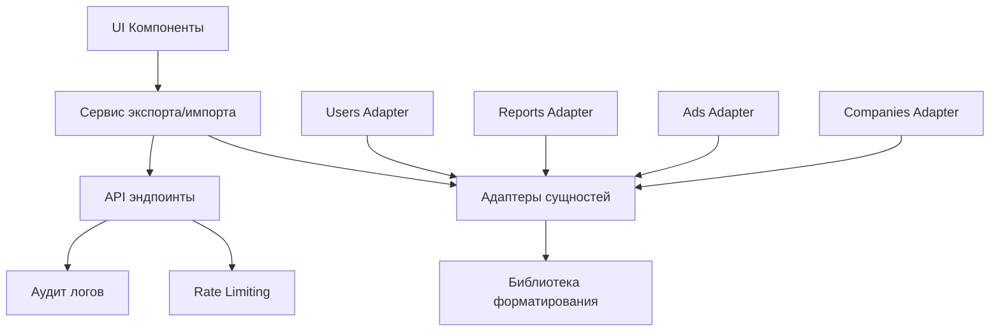

# Универсальный инструмент импорта/экспорта данных

## Обзор проекта

Создание масштабируемого инструмента для импорта и экспорта данных в различных форматах (XLS, XLSX, CSV) для всех сущностей системы: пользователи, отчеты, объявления (Доска объявлений), компании.

## Архитектура решения

### Основные компоненты



### Интерфейсы и типы

```typescript
// Базовый интерфейс для экспортируемых сущностей
interface IExportableEntity {
  id: string | number
  getExportData(): Record<string, any>
  getExportFields(): ExportField[]
  validateForExport(): ValidationResult
}

// Конфигурация поля экспорта
interface ExportField {
  key: string
  label: string
  type: 'string' | 'number' | 'date' | 'boolean'
  required?: boolean
  transform?: (value: any) => any
}

// Адаптер сущности
interface IEntityAdapter<T> {
  entityType: string
  exportFields: ExportField[]
  importFields: ImportField[]

  // Экспорт
  getDataForExport(filters?: any): Promise<T[]>
  transformForExport(data: T[]): Record<string, any>[]

  // Импорт
  validateImportData(data: Record<string, any>[]): ValidationResult[]
  transformForImport(data: Record<string, any>[]): Partial<T>[]
  saveImportedData(data: Partial<T>[]): Promise<ImportResult>
}
```

## Спецификации сущностей

### 1. Пользователи (Users)

**Экспортируемые поля:**
- ID пользователя
- Полное имя
- Email
- Роль
- Статус активации
- Дата регистрации
- Последний вход
- Количество объявлений (для продавцов)

**Ограничения безопасности:**
- Исключение поля пароля
- Маскировка email для не-администраторов
- Фильтрация по ролям

### 2. Отчеты (Reports)

**Экспортируемые поля:**
- ID отчета
- Тип отчета
- Период
- Создано пользователем
- Дата создания
- Статус
- Метрики (JSON)

### 3. Объявления (Ads/Доска объявлений)

**Экспортируемые поля:**
- ID объявления
- Заголовок
- Описание
- Цена
- Валюта
- Категория
- Статус (активно/неактивно/продано)
- Автор (ID пользователя)
- Дата создания
- Дата обновления
- Просмотры
- Избранное
- Локация
- Фото (URL основного фото)

**Импорт валидации:**
- Обязательные поля: заголовок, цена, категория
- Формат цены: число > 0
- Максимальная длина описания: 5000 символов
- Валидные категории из справочника

### 4. Компании (Companies)

**Экспортируемые поля:**
- ID компании
- Название
- Описание
- Тип компании
- Статус верификации
- Контактная информация
- Дата регистрации
- Количество объявлений
- Рейтинг
- Владелец (ID пользователя)

## Техническая реализация

### Фаза 1: Базовая инфраструктура (1-2 недели)

#### Задачи:
1. **Установка зависимостей**
   ```bash
   npm install xlsx @types/xlsx papaparse @types/papaparse
   npm install zod joi # для валидации
   ```

2. **Создание базовых интерфейсов**
   - `src/types/export-import.ts`
   - `src/services/export/ExportService.ts`
   - `src/services/import/ImportService.ts`

3. **Базовый UI компонент экспорта**
   ```typescript
   // src/components/export/ExportButton.tsx
   interface ExportButtonProps {
     entityType: 'users' | 'reports' | 'ads' | 'companies'
     format: 'xlsx' | 'xls' | 'csv'
     filters?: any
     selectedIds?: string[]
   }
   ```

### Фаза 2: Адаптеры сущностей (2-3 недели)

#### UsersAdapter
```typescript
export class UsersAdapter implements IEntityAdapter<User> {
  entityType = 'users'

  exportFields: ExportField[] = [
    { key: 'id', label: 'ID', type: 'string' },
    { key: 'fullName', label: 'Full Name', type: 'string', required: true },
    { key: 'email', label: 'Email', type: 'string', required: true },
    // ... остальные поля
  ]

  async getDataForExport(filters?: any): Promise<User[]> {
    // Логика получения данных с учетом фильтров и безопасности
  }
}
```

#### AdsAdapter (Доска объявлений)
```typescript
export class AdsAdapter implements IEntityAdapter<Ad> {
  entityType = 'ads'

  exportFields: ExportField[] = [
    { key: 'id', label: 'ID объявления', type: 'string' },
    { key: 'title', label: 'Заголовок', type: 'string', required: true },
    { key: 'description', label: 'Описание', type: 'string' },
    { key: 'price', label: 'Цена', type: 'number', required: true },
    { key: 'currency', label: 'Валюта', type: 'string', required: true },
    { key: 'category', label: 'Категория', type: 'string', required: true },
    { key: 'status', label: 'Статус', type: 'string' },
    { key: 'authorId', label: 'Автор', type: 'string' },
    { key: 'createdAt', label: 'Дата создания', type: 'date' },
    { key: 'views', label: 'Просмотры', type: 'number' },
    { key: 'location', label: 'Локация', type: 'string' }
  ]

  importFields: ImportField[] = [
    // Аналогично exportFields с дополнительными правилами валидации
  ]
}
```

### Фаза 3: API эндпоинты (1 неделя)

#### Export API
```typescript
// src/app/api/export/[entity]/route.ts
export async function POST(request: Request, { params }: { params: { entity: string } }) {
  const { format, filters, selectedIds } = await request.json()

  const adapter = ExportAdapterFactory.getAdapter(params.entity)
  const data = await adapter.getDataForExport(filters, selectedIds)

  const workbook = XLSX.utils.book_new()
  const worksheet = XLSX.utils.json_to_sheet(data)
  XLSX.utils.book_append_sheet(workbook, worksheet, params.entity)

  const buffer = XLSX.write(workbook, { type: 'buffer' })

  return new Response(buffer, {
    headers: {
      'Content-Type': 'application/vnd.openxmlformats-officedocument.spreadsheetml.sheet',
      'Content-Disposition': `attachment; filename=${params.entity}_${Date.now()}.${format}`
    }
  })
}
```

#### Import API
```typescript
// src/app/api/import/[entity]/route.ts
export async function POST(request: Request, { params }: { params: { entity: string } }) {
  const formData = await request.formData()
  const file = formData.get('file') as File

  if (!file) {
    return Response.json({ error: 'No file provided' }, { status: 400 })
  }

  const adapter = ImportAdapterFactory.getAdapter(params.entity)
  const data = await parseFile(file)

  const validationResults = adapter.validateImportData(data)
  const validData = data.filter((_, index) => validationResults[index].isValid)

  const result = await adapter.saveImportedData(validData)

  return Response.json({
    success: true,
    imported: result.successCount,
    errors: validationResults.filter(r => !r.isValid)
  })
}
```

### Фаза 4: UI компоненты (1-2 недели)

#### ExportDialog
```typescript
// src/components/export/ExportDialog.tsx
interface ExportDialogProps {
  open: boolean
  onClose: () => void
  entityType: string
  availableFormats: string[]
  onExport: (format: string, filters: any) => void
}
```

#### ImportDialog с drag & drop
```typescript
// src/components/import/ImportDialog.tsx
interface ImportDialogProps {
  open: boolean
  onClose: () => void
  entityType: string
  onImport: (file: File) => Promise<ImportResult>
  templateUrl?: string // Ссылка на шаблон для импорта
}
```

### Фаза 5: Безопасность и производительность (1 неделя)

#### Rate Limiting
```typescript
// Интеграция с существующей системой rate limiting
const exportLimiter = new RateLimit({
  windowMs: 15 * 60 * 1000, // 15 minutes
  max: 10, // limit each user to 10 exports per windowMs
  keyGenerator: (req) => req.user?.id
})
```

#### Аудит логов
```typescript
// src/services/audit/ExportAuditService.ts
export class ExportAuditService {
  async logExport(userId: string, entityType: string, recordCount: number) {
    await prisma.auditLog.create({
      data: {
        userId,
        action: 'EXPORT',
        entityType,
        recordCount,
        timestamp: new Date()
      }
    })
  }
}
```

## Тестирование

### Unit тесты
- Адаптеры сущностей
- Сервисы экспорта/импорта
- Валидация данных
- Трансформации

### Integration тесты
- Полный цикл экспорта
- Импорт с валидацией
- Обработка ошибок
- Rate limiting

### E2E тесты
- UI компоненты
- Файловые операции
- Кросс-браузерная совместимость

## Развертывание и миграция

### Feature Flags
```typescript
// src/config/features.ts
export const FEATURES = {
  EXPORT_USERS: process.env.FEATURE_EXPORT_USERS === 'true',
  EXPORT_ADS: process.env.FEATURE_EXPORT_ADS === 'true',
  IMPORT_ADS: process.env.FEATURE_IMPORT_ADS === 'true',
  // ...
}
```

### План развертывания
1. **Alpha**: Только экспорт пользователей (существующий функционал)
2. **Beta**: Экспорт всех сущностей
3. **Stable**: Импорт + экспорт всех сущностей
4. **Production**: Полная функциональность

## Мониторинг и метрики

### Ключевые метрики
- Количество экспортов/импортов в день
- Среднее время обработки
- Процент успешных операций
- Размеры файлов
- Ошибки по типам

### Логирование
- Все операции экспорта/импорта
- Ошибки и исключения
- Производительность
- Аудит безопасности

## Документация

### Для разработчиков
- API спецификации
- Примеры использования адаптеров
- Руководство по добавлению новых сущностей

### Для пользователей
- Инструкции по экспорту/импорту
- Шаблоны файлов
- Ограничения и рекомендации

## Roadmap

### Короткосрочный (1-3 месяца)
- ✅ Экспорт пользователей
- ✅ Экспорт объявлений
- ✅ Базовый импорт объявлений
- ✅ UI компоненты

### Среднесрочный (3-6 месяцев)
- ✅ Экспорт компаний
- ✅ Расширенная валидация импорта
- ✅ Background jobs для больших файлов
- ✅ Email уведомления

### Долгосрочный (6+ месяцев)
- ✅ Интеграция с внешними API
- ✅ Scheduled exports
- ✅ Advanced filtering
- ✅ Data transformation pipelines

## Заключение

Данная архитектура обеспечивает:
- **Масштабируемость**: Легкое добавление новых сущностей
- **Безопасность**: Rate limiting, аудит, валидация
- **Производительность**: Оптимизированная обработка больших объемов
- **Надежность**: Комплексное тестирование и мониторинг
- **Пользовательский опыт**: Интуитивный UI с drag & drop

Общий срок реализации: 8-12 недель
Команда: 2-3 разработчика
Приоритет: Высокий (улучшает операционную эффективность)


