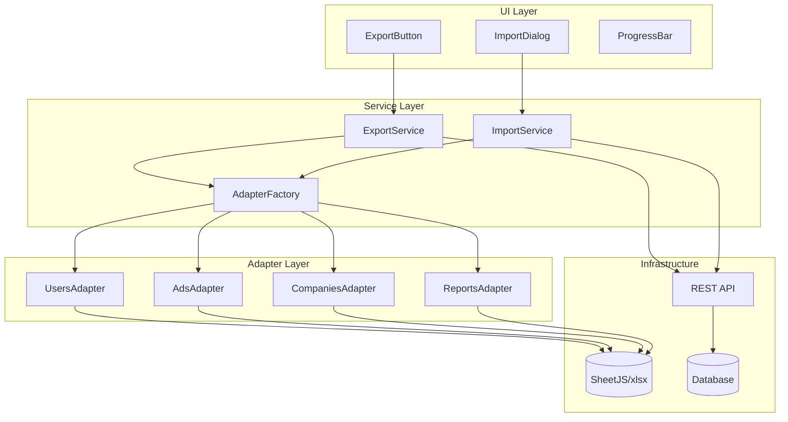

# Техническое задание: Универсальный инструмент импорта/экспорта данных

**Версия:** 1.0  
**Дата:** 22 ноября 2025 г.  
**Статус:** Утверждено для поэтапной реализации  

## 1. Обзор проекта

### 1.1 Цель
Создание универсального, масштабируемого инструмента для импорта и экспорта данных в различных форматах (XLS, XLSX, CSV) для всех сущностей системы: пользователи, отчеты, объявления (Доска объявлений), компании.

### 1.2 Бизнес-обоснование
- Повышение операционной эффективности администраторов
- Упрощение миграции данных между системами
- Стандартизация процессов импорта/экспорта
- Масштабируемость для будущих сущностей

### 1.3 Текущие сущности
- ✅ Пользователи (Users) - реализовано частично
- ✅ Отчеты (Reports) - требуется анализ
- ⏳ Объявления (Ads/Доска объявлений) - в разработке
- ⏳ Компании (Companies) - планируется

## 2. Функциональные требования

### 2.1 Экспорт данных

#### 2.1.1 Поддерживаемые форматы
- Microsoft Excel 2007+ (XLSX) - основной формат
- Microsoft Excel 97-2003 (XLS) - для совместимости
- CSV (Comma-Separated Values) - для интеграций

#### 2.1.2 Режимы экспорта
- **Полный экспорт**: все записи сущности
- **Фильтрованный экспорт**: по заданным критериям
- **Выборочный экспорт**: только выбранные записи

#### 2.1.3 Ограничения безопасности
- Фильтрация чувствительных данных (пароли, токены)
- Проверка прав доступа пользователя
- Rate limiting (не более 10 экспортов за 15 минут)
- Аудит всех операций экспорта

### 2.2 Импорт данных

#### 2.2.1 Поддерживаемые форматы
- Microsoft Excel (XLSX, XLS)
- CSV с различными разделителями

#### 2.2.2 Режимы импорта
- **Создание новых записей**
- **Обновление существующих** (по ключевым полям)
- **Смешанный режим** (создание + обновление)

#### 2.2.3 Валидация данных
- Проверка обязательных полей
- Валидация форматов данных
- Проверка бизнес-правил
- Предварительный анализ перед импортом

### 2.3 Пользовательский интерфейс

#### 2.3.1 Компоненты экспорта
- Кнопка "Экспорт" в таблицах данных
- Диалог выбора формата и фильтров
- Индикатор прогресса для больших файлов

#### 2.3.2 Компоненты импорта
- Drag & drop область для файлов
- Предварительный просмотр данных
- Отчет об импорте (успешно/ошибки)

## 3. Архитектура решения

### 3.1 Общая архитектура



### 3.2 Интерфейсы и типы

#### 3.2.1 Базовые интерфейсы

```typescript
// Базовый интерфейс экспортируемой сущности
interface IExportableEntity {
  id: string | number
  getExportData(): Record<string, any>
  getExportFields(): ExportField[]
  validateForExport(): ValidationResult
}

// Конфигурация поля экспорта
interface ExportField {
  key: string                    // Ключ поля в данных
  label: string                  // Отображаемое название
  type: 'string' | 'number' | 'date' | 'boolean'
  required?: boolean            // Обязательное поле
  transform?: (value: any) => any // Функция трансформации
  width?: number                // Ширина колонки в Excel
}

// Результат валидации
interface ValidationResult {
  isValid: boolean
  errors: ValidationError[]
}

// Адаптер сущности
interface IEntityAdapter<T> {
  entityType: string
  exportFields: ExportField[]
  importFields: ImportField[]

  // Экспорт
  getDataForExport(filters?: any): Promise<T[]>
  transformForExport(data: T[]): Record<string, any>[]

  // Импорт
  validateImportData(data: Record<string, any>[]): ValidationResult[]
  transformForImport(data: Record<string, any>[]): Partial<T>[]
  saveImportedData(data: Partial<T>[]): Promise<ImportResult>
}
```

#### 3.2.2 Специфические типы

```typescript
// Результат импорта
interface ImportResult {
  successCount: number
  errorCount: number
  errors: ImportError[]
  warnings: ImportWarning[]
}

// Настройки экспорта
interface ExportOptions {
  format: 'xlsx' | 'xls' | 'csv'
  filters?: Record<string, any>
  selectedIds?: string[]
  includeHeaders: boolean
  dateFormat?: string
}

// Настройки импорта
interface ImportOptions {
  mode: 'create' | 'update' | 'upsert'
  skipValidation?: boolean
  batchSize?: number
  onProgress?: (progress: number) => void
}
```

## 4. Спецификации сущностей

### 4.1 Пользователи (Users)

#### Экспортируемые поля:
```typescript
const userExportFields: ExportField[] = [
  { key: 'id', label: 'ID', type: 'string', width: 10 },
  { key: 'fullName', label: 'Полное имя', type: 'string', required: true, width: 25 },
  { key: 'email', label: 'Email', type: 'string', required: true, width: 30 },
  { key: 'role', label: 'Роль', type: 'string', required: true, width: 15 },
  { key: 'isActive', label: 'Активен', type: 'boolean', width: 10 },
  { key: 'createdAt', label: 'Дата регистрации', type: 'date', width: 15 },
  { key: 'lastLogin', label: 'Последний вход', type: 'date', width: 15 }
]
```

#### Ограничения безопасности:
- Email маскируется для пользователей без прав admin
- Поле password никогда не экспортируется
- Superadmin пользователи фильтруются автоматически

### 4.2 Объявления (Ads/Доска объявлений)

#### Экспортируемые поля:
```typescript
const adsExportFields: ExportField[] = [
  { key: 'id', label: 'ID объявления', type: 'string', width: 12 },
  { key: 'title', label: 'Заголовок', type: 'string', required: true, width: 40 },
  { key: 'description', label: 'Описание', type: 'string', width: 50 },
  { key: 'price', label: 'Цена', type: 'number', required: true, width: 12 },
  { key: 'currency', label: 'Валюта', type: 'string', required: true, width: 8 },
  { key: 'category', label: 'Категория', type: 'string', required: true, width: 20 },
  { key: 'status', label: 'Статус', type: 'string', width: 15 },
  { key: 'authorId', label: 'Автор', type: 'string', width: 12 },
  { key: 'createdAt', label: 'Дата создания', type: 'date', width: 15 },
  { key: 'views', label: 'Просмотры', type: 'number', width: 10 },
  { key: 'location', label: 'Локация', type: 'string', width: 25 }
]
```

#### Правила валидации импорта:
- Заголовок: обязательное, 5-100 символов
- Цена: обязательное, положительное число
- Категория: обязательное, из справочника категорий
- Описание: опциональное, макс 5000 символов

### 4.3 Компании (Companies)

#### Экспортируемые поля:
```typescript
const companiesExportFields: ExportField[] = [
  { key: 'id', label: 'ID компании', type: 'string', width: 12 },
  { key: 'name', label: 'Название', type: 'string', required: true, width: 30 },
  { key: 'description', label: 'Описание', type: 'string', width: 50 },
  { key: 'type', label: 'Тип компании', type: 'string', required: true, width: 20 },
  { key: 'isVerified', label: 'Верифицирована', type: 'boolean', width: 15 },
  { key: 'ownerId', label: 'Владелец', type: 'string', width: 12 },
  { key: 'createdAt', label: 'Дата регистрации', type: 'date', width: 15 },
  { key: 'adsCount', label: 'Количество объявлений', type: 'number', width: 20 },
  { key: 'rating', label: 'Рейтинг', type: 'number', width: 10 }
]
```

### 4.4 Отчеты (Reports)

#### Экспортируемые поля:
```typescript
const reportsExportFields: ExportField[] = [
  { key: 'id', label: 'ID отчета', type: 'string', width: 12 },
  { key: 'type', label: 'Тип отчета', type: 'string', required: true, width: 20 },
  { key: 'period', label: 'Период', type: 'string', width: 15 },
  { key: 'createdBy', label: 'Создано пользователем', type: 'string', width: 20 },
  { key: 'createdAt', label: 'Дата создания', type: 'date', width: 15 },
  { key: 'status', label: 'Статус', type: 'string', width: 12 },
  { key: 'metrics', label: 'Метрики', type: 'string', width: 30 }
]
```

## 5. Техническая реализация

### 5.1 Зависимости

```json
{
  "dependencies": {
    "xlsx": "^0.18.5",
    "papaparse": "^5.4.1"
  },
  "devDependencies": {
    "@types/xlsx": "^0.0.36",
    "@types/papaparse": "^5.3.7"
  }
}
```

### 5.2 Структура файлов

```
src/
├── types/
│   └── export-import.ts          # Общие типы и интерфейсы
├── services/
│   ├── export/
│   │   ├── ExportService.ts      # Основной сервис экспорта
│   │   ├── ExportAdapterFactory.ts # Фабрика адаптеров
│   │   └── adapters/
│   │       ├── UsersAdapter.ts
│   │       ├── AdsAdapter.ts
│   │       ├── CompaniesAdapter.ts
│   │       └── ReportsAdapter.ts
│   └── import/
│       ├── ImportService.ts      # Основной сервис импорта
│       └── validators.ts         # Валидаторы данных
├── components/
│   ├── export/
│   │   ├── ExportButton.tsx      # Универсальная кнопка экспорта
│   │   └── ExportDialog.tsx      # Диалог настроек экспорта
│   └── import/
│       ├── ImportDialog.tsx      # Диалог импорта с drag&drop
│       └── ImportProgress.tsx    # Индикатор прогресса
└── app/
    └── api/
        ├── export/
        │   └── [entity]/
        │       └── route.ts       # API экспорта
        └── import/
            └── [entity]/
                └── route.ts       # API импорта
```

### 5.3 API спецификация

#### 5.3.1 Export API

**Endpoint:** `POST /api/export/[entity]`

**Request Body:**
```typescript
{
  "format": "xlsx" | "xls" | "csv",
  "filters": {
    "status": "active",
    "category": "electronics"
  },
  "selectedIds": ["1", "2", "3"],
  "includeHeaders": true
}
```

**Response:** Binary file stream

#### 5.3.2 Import API

**Endpoint:** `POST /api/import/[entity]`

**Request:** Multipart form data with file

**Response:**
```typescript
{
  "success": true,
  "imported": 150,
  "errors": [
    {
      "row": 5,
      "field": "email",
      "message": "Invalid email format"
    }
  ]
}
```

## 6. План реализации

### 6.1 Фаза 1: Базовая инфраструктура (1-2 недели)

#### Задачи:
1. **Создание интерфейсов и типов**
   - `src/types/export-import.ts`
   - `src/services/export/ExportService.ts`
   - `src/services/import/ImportService.ts`

2. **Настройка зависимостей**
   - Установка xlsx, papaparse
   - Конфигурация TypeScript типов

3. **Базовые UI компоненты**
   - ExportButton с выбором формата
   - Простой ImportDialog

4. **API структура**
   - Базовые эндпоинты экспорта/импорта
   - Middleware для rate limiting

### 6.2 Фаза 2: UsersAdapter (1 неделя)

#### Задачи:
1. **Реализация UsersAdapter**
   - Конфигурация полей экспорта
   - Логика получения данных с фильтрами
   - Безопасность и валидация

2. **Интеграция с UI**
   - Добавление экспорта в таблицу пользователей
   - Тестирование различных форматов

3. **Документация**
   - Обновление спецификаций
   - Примеры использования

### 6.3 Фаза 3: AdsAdapter (1-2 недели, после готовности модуля Ads)

#### Задачи:
1. **Анализ структуры данных Ads**
   - Определение полей для экспорта/импорта
   - Бизнес-правила валидации

2. **Реализация AdsAdapter**
   - Конфигурация полей
   - Логика трансформации данных
   - Валидация импорта

3. **Интеграция и тестирование**
   - UI компоненты для Ads
   - Тестирование с реальными данными

### 6.4 Фаза 4: CompaniesAdapter (1-2 недели, после готовности модуля Companies)

Аналогично Фазе 3 для сущности Companies.

### 6.5 Фаза 5: Финализация и оптимизация (1 неделя)

#### Задачи:
1. **ReportsAdapter** (если требуется)
2. **Улучшения UI/UX**
   - Drag & drop для импорта
   - Progress indicators
   - Error handling

3. **Оптимизация производительности**
   - Streaming для больших файлов
   - Background processing
   - Кэширование

4. **Тестирование и документация**
   - Полный набор тестов
   - Обновление документации
   - Руководство пользователя

## 7. Безопасность

### 7.1 Аутентификация и авторизация
- Все операции требуют аутентификации
- Проверка прав доступа к сущностям
- Аудит всех операций экспорта/импорта

### 7.2 Rate Limiting
```typescript
const exportLimiter = {
  windowMs: 15 * 60 * 1000, // 15 minutes
  max: 10, // 10 exports per window
  message: "Too many export requests"
}
```

### 7.3 Валидация данных
- Серверная валидация всех входных данных
- Защита от SQL injection
- Ограничение размера файлов (макс 50MB)

### 7.4 Аудит
- Логирование всех операций
- Отслеживание изменений данных
- Мониторинг подозрительной активности

## 8. Производительность

### 8.1 Оптимизации экспорта
- Streaming для больших наборов данных
- Пагинация при получении данных из БД
- Компрессия файлов перед отправкой

### 8.2 Оптимизации импорта
- Batch processing (пакетная обработка)
- Параллельная валидация
- Transaction management для целостности данных

### 8.3 Мониторинг
- Метрики производительности
- Оповещения о проблемах
- Логирование длительных операций

## 9. Тестирование

### 9.1 Unit тесты
- Адаптеры сущностей
- Сервисы экспорта/импорта
- Валидация данных
- Трансформации

### 9.2 Integration тесты
- Полный цикл экспорта
- Импорт с валидацией
- API endpoints
- База данных

### 9.3 E2E тесты
- UI компоненты
- Файловые операции
- Кросс-браузерная совместимость
- Мобильные устройства

## 10. Развертывание и поддержка

### 10.1 Feature Flags
```typescript
// src/config/features.ts
export const FEATURES = {
  EXPORT_USERS: true,
  EXPORT_ADS: false,      // Включаем после готовности Ads
  IMPORT_ADS: false,      // Включаем после тестирования
  EXPORT_COMPANIES: false // Включаем после готовности Companies
}
```

### 10.2 Мониторинг
- Метрики использования
- Ошибки и проблемы
- Производительность
- Безопасность

### 10.3 Поддержка
- Документация для разработчиков
- Руководство пользователя
- FAQ и troubleshooting
- Обновления и улучшения

## 11. Риски и mitigation

### 11.1 Технические риски
- **Большой объем данных**: Streaming и пагинация
- **Сложность валидации**: Модульная архитектура валидаторов
- **Производительность**: Кэширование и оптимизации

### 11.2 Бизнес-риски
- **Изменения требований**: Итеративная разработка
- **Задержки с модулями**: Независимая реализация адаптеров
- **Безопасность данных**: Многоуровневая защита

## 12. Заключение

Данная спецификация определяет создание универсального, масштабируемого инструмента импорта/экспорта данных. Архитектура позволяет легко добавлять новые сущности и обеспечивает высокую производительность, безопасность и удобство использования.

**Общий срок реализации:** 8-12 недель  
**Команда:** 2-3 разработчика  
**Приоритет:** Высокий  
**Бюджет:** Рассчитывается после утверждения плана

---

**Утверждено:** ____________________  
**Дата:** ____________________  
**Ответственный:** ____________________


